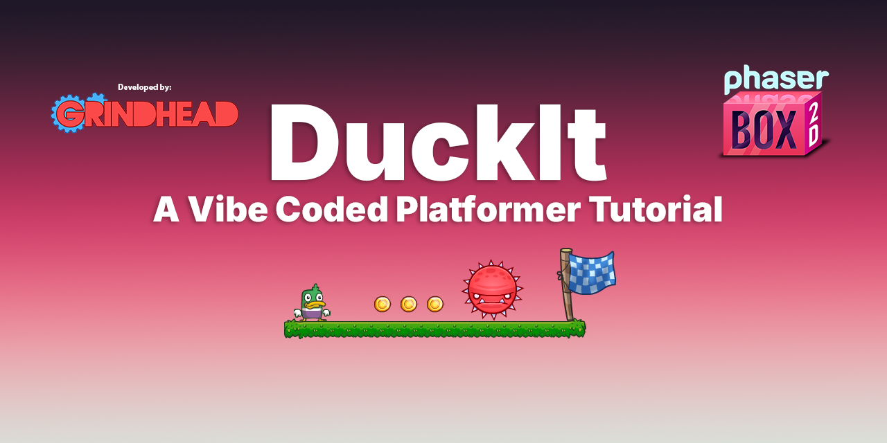

# DuckIt - a Vibe Coded Platformer Tutorial

This is a demo app that any can use to get familar with making games using vibe coding.

Here are the links to the apps used within the project:

Cursor
NodeJS - this includes NPM.
Git
TexturePacker (optional)
Sourcetree (optional)

Remember to add SSH keys when working with Github.
[Add SSH keys to Github on Mac](https://docs.github.com/en/authentication/connecting-to-github-with-ssh/generating-a-new-ssh-key-and-adding-it-to-the-ssh-agent?platform=mac)
[Add SSH keys to Github on Windows](https://docs.github.com/en/authentication/connecting-to-github-with-ssh/generating-a-new-ssh-key-and-adding-it-to-the-ssh-agent?platform=windows)

Shout out to:

Matthew Berman:

[@MatthewBerman on Twitter](https://x.com/MatthewBerman)

[Vibe Coding Complete Tutorial and Tips - Cursor / Windsurf](https://www.youtube.com/watch?v=v7UcVPO4y3c&list=PL8CxOpJNgWgfvmw4ICbxEwCEjS7lhhxcQ)

Cline:

[Cline Memory Bank](https://docs.cline.bot/improving-your-prompting-skills/cline-memory-bank)

Jimp for assets:

[ArtJimp on X](https://x.com/artjimp)

Jay Max Armstrong for assets:

[Jay Armstrong on X](https://x.com/JayMaxArmstrong)

Both from

[MassiveMonster](https://massivemonster.com/)
